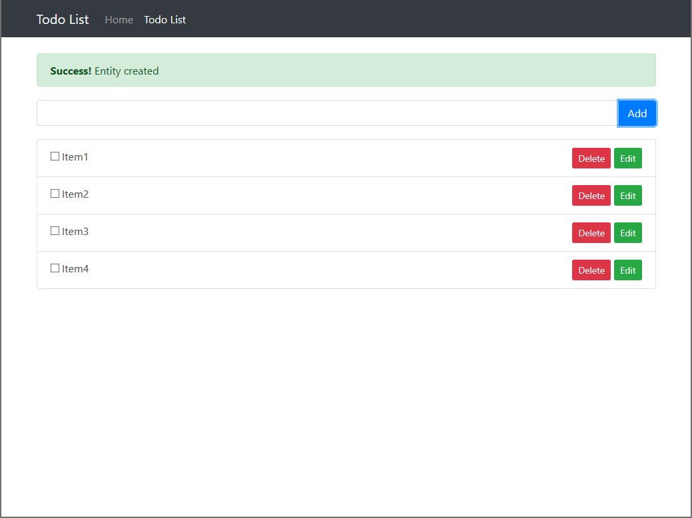

# AKeToan entry project

Assignment 1:

1. implement api POST/GET/PUT/DELETE to CRUD doto, using mongodb, mongoosejs as mongo driver(v)
2. implement web app using ant design and reactjs (v)
3. implement redux action, reducer to state management
4. implement authentication machanism base on JWT. (v)
5. implement jest to test api. using supertest and mongodb-memory-server to test api
6. implement snapshot test
7. setup Dockerfile to build image

Assignment 2:
1. import file dataSaleOrder.csv to db, try design schema for yourself
2. finding regularly customer on specific date time(format yyyy-mm-dd HH:mm:ss). regularly customer is the customer purchase order in two continuos months

For example:

no purchase order for customerA on Jan

no purchase order for customerA on Feb

customerA purchase order1 on 2019 mar 19

customerA purchase order2 on 2019 apr 25

no purchase order for customerA on May

no purchase order for customerA on Jun

=> on march, and par customerA is not regularly customer but on may customer become regular customer, but on jun he is removed from regular customer group
